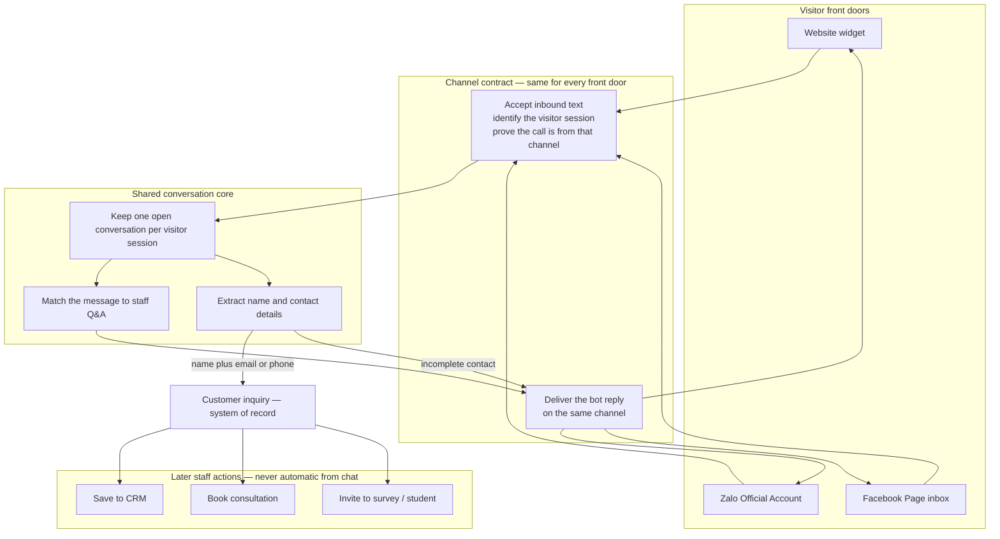

# Feature Specification: Facebook Messenger Channel

**Feature Branch**: `001-facebook-messenger`

**Created**: 2026-08-23

**Status**: Draft

**Input**: User description: "Help me review Zalo integration now I need to support for facebook chat message integration. also add diagram for chatbot platform pattern"

**Constitution**: Principles I (Inquiry-First), III (Public Surface Safety), and IV (Integration Isolation). New inbound channel traffic MUST land on a conversation and, when contact details are complete, on `customer.inquiry` before any CRM / Calendar / Survey / OpenEduCat side effect. The Facebook receive address is an untrusted public surface. Facebook is an isolated channel adapter, not a second inquiry hub.

## Overview

Staff already collect website-widget and Zalo Official Account conversations into one inquiry queue. Facebook Page inbox is a third front door: the same Q&A, the same contact-collection rules, and the same staff follow-up — tagged as Facebook so it can be filtered.

This spec also records the **chatbot platform pattern** that Zalo already follows, so Facebook (and any later channel) plugs in as another adapter rather than a parallel product.

## Clarifications

### Session 2026-08-23

- Q: Should Facebook have its own receive address, or share the same inbound address Zalo already uses? → A: Shared inbound address, split by query param `merchant=zalo` or `merchant=facebook` (do not add `channel=`)
- Q: After a Facebook chat has already created an inquiry and ended, what should happen when that same person messages the Page again? → A: Start a new Facebook conversation; a later complete contact creates a new inquiry
- Q: If a staff member replies in the Facebook Page inbox, should the bot keep answering that visitor? → A: Yes — the bot always auto-replies while the channel is enabled
- Q: If Messenger refuses the bot’s reply, should the product retry sending, or only record the failure? → A: Do not retry; keep conversation/inquiry consistent and record the failure for a Manager
- Q: If Facebook says the Page access is no longer valid, should the product try to refresh credentials and send once more, or stop and wait for a Manager? → A: Like Zalo — refresh credentials once and send the same reply again

## Current State: Zalo Channel Review

Zalo is the reference messaging channel. Facebook MUST match this visitor and staff experience, and MUST NOT copy Zalo’s known gaps.

| Capability | Zalo today | Facebook in this feature |
|---|---|---|
| Visitor sends a text and gets an automatic reply | Yes | Required |
| Same Q&A answers as the website widget | Yes | Required |
| Name plus email or phone creates an inquiry and ends the chat | Yes | Required |
| Conversation and inquiry tagged with the channel | Yes (`zalo`) | Required (`facebook`) |
| Staff enter channel credentials in Chatbot Settings | Yes | Required |
| Channel can be turned off without affecting other channels | No | Required (do not copy the gap) |
| Inbound calls are proven to come from the channel | No | Required for Facebook (Meta will not complete setup without a handshake; unsigned calls MUST be rejected) |
| Channel appears as a selectable inquiry source out of the box | Yes | Required (the Facebook source code exists but is not created for staff today) |
| Website widget button that opens the messaging app | Yes (`zalo.me` link) | Already exists (`m.me` link); unchanged |
| Images, stickers, buttons, or file attachments | Not handled | Out of scope — ignore safely |
| Live staff takeover inside the messaging app | No | Out of scope — bot still auto-replies while the channel is on |

**What Zalo already gets right (the pattern to reuse):**

- One conversation engine. Zalo does not invent its own answers or its own inquiry rules.
- Channel identity is stamped when the conversation starts and copied onto the inquiry. Later promotions do not overwrite it.
- The reply is sent back on the same channel the visitor used.
- A failure to send the reply must not invent a second inquiry or wipe the conversation.

**What Zalo leaves unfinished (do not repeat for Facebook):**

- There is no on/off switch, so a misconfigured Official Account still accepts traffic.
- Inbound messages are accepted without proving they came from Zalo.
- Routing today depends on a caller-supplied hint. This feature keeps that hint: one shared receive address split by `merchant=zalo` or `merchant=facebook` (staff configure that on the URL they register; visitors never type it). Do not add a second query name (`channel=`).
- The Facebook source is listed as a code but is not seeded, so staff cannot reliably filter Facebook inquiries today.

Fixing Zalo’s missing on/off switch and inbound authenticity proof is **out of scope**. Teaching the shared receive address to accept `merchant=facebook` without breaking `merchant=zalo` is **in scope**.

## Chatbot Platform Pattern

Every front door is a **channel**. Channels differ only in how a message arrives and how a reply leaves. Everything after that is shared.

**Channel contract** (what Facebook MUST implement, and what Zalo already approximates):

1. **Identify** the visitor session so follow-up messages stay on the same conversation.
2. **Authenticate** inbound traffic for that channel (required for Facebook; known gap for Zalo).
3. **Hand the text** to the shared conversation core. Do not bypass inquiry creation.
4. **Stamp the source** (`facebook`, `zalo`, or website chatbot) on the conversation and any inquiry it creates.
5. **Send the reply** on the originating channel. If sending fails, keep the conversation and inquiry consistent and record the failure for staff.
6. **Stay isolated.** A Facebook outage or bad credential MUST NOT stop website or Zalo chats. Turning Facebook off MUST leave other channels working.

**Shared core rules** (already true; Facebook MUST not fork them):

- Original visitor text on the inquiry is immutable.
- Inquiry requires a name and at least email or phone.
- Chat never silently creates a CRM lead, calendar booking, survey response, or student record.
- Users still see only assigned inquiries; Managers see all. Channel does not change visibility.

## User Scenarios & Testing *(mandatory)*

### User Story 1 - Visitor chats with the Facebook Page and gets the same answers (Priority: P1)

A prospective customer opens the school or company Facebook Page, taps Message, and asks a question they would also ask on the website widget (hours, programs, fees, how to enroll). They receive the same automatic answer the widget would have given. The exchange is stored as a Facebook-sourced conversation.

**Why this priority**: Without inbound text and an automatic reply, Facebook is not a channel — it is only a link on the widget.

**Independent Test**: With Facebook enabled and credentials set, send a known Q&A question from a test Page inbox. Confirm the expected answer arrives in Messenger and a Facebook-sourced conversation exists with both messages.

**Acceptance Scenarios**:

1. **Given** Facebook is enabled and credentials are valid, **When** a visitor sends a text that matches an active Q&A, **Then** they receive that Q&A answer in Messenger and the conversation is tagged Facebook.
2. **Given** Facebook is enabled, **When** a visitor sends a text that matches no Q&A, **Then** they receive the same fallback / prompt behavior as the other channels (as text, not as a website form).
3. **Given** Facebook is disabled or credentials are missing, **When** a visitor messages the Page, **Then** the system does not create a conversation or inquiry and does not send a bot reply.
4. **Given** Facebook is enabled and a staff member has also written in that Page thread, **When** the visitor sends another text, **Then** the bot still replies (staff who need a quiet thread turn the channel off).

---

### User Story 2 - Complete contact details become a Facebook inquiry (Priority: P1)

The visitor types their name and an email or phone (and optionally a preferred consultation time) in the Messenger thread. The system creates a customer inquiry, ends the conversation, and sends the configured end message. Staff see the inquiry in the existing queue, sourced as Facebook, with the original message unchanged.

**Why this priority**: Inquiry-first is the product. A Facebook chat that never becomes an inquiry has no staff workflow.

**Independent Test**: From a test Messenger thread, send a message containing a name plus email or phone. Confirm one new inquiry appears, source is Facebook, conversation is ended, and the visitor received the end message.

**Acceptance Scenarios**:

1. **Given** an active Facebook conversation, **When** the visitor provides a name and an email or phone, **Then** one inquiry is created, linked to that conversation, sourced Facebook, and the conversation status is ended.
2. **Given** the visitor provides a name but neither email nor phone, **When** that message is processed, **Then** no inquiry is created, the conversation stays open, and they receive the missing-contact message.
3. **Given** an inquiry was just created from Facebook, **When** staff open it, **Then** the original visitor text is present and has not been replaced by analysis or by the bot reply.
4. **Given** a Facebook inquiry exists, **When** a Chatbot User who is not assigned to it opens the inquiry list, **Then** they do not see it; a Manager does.
5. **Given** a Facebook conversation already ended with an inquiry, **When** that same person messages the Page again, **Then** a new conversation starts, the previous inquiry is unchanged, and a new inquiry is created only if this new conversation again collects name plus email or phone.

---

### User Story 3 - Staff connect and verify the Facebook Page (Priority: P1)

A Chatbot Manager opens Chatbot Settings, enters the Facebook Page connection details, turns the channel on, and completes Facebook’s subscription check using the **shared** receive address with `merchant=facebook` plus a verify phrase the product provides. After a successful check, inbound Page messages start flowing. The Manager can turn the channel off later without affecting Zalo or the website widget. Zalo remains registered on the same address with `merchant=zalo`.

**Why this priority**: Facebook will not deliver production messages until the receive address answers the subscription check. Settings are how every other secret is managed.

**Independent Test**: Save valid settings, run Facebook’s subscription check, confirm it succeeds, then disable the channel and confirm new Page messages no longer create conversations.

**Acceptance Scenarios**:

1. **Given** a Manager is on Chatbot Settings, **When** they save Facebook Page credentials and enable the channel, **Then** those values persist and are not visible in the public widget script.
2. **Given** Facebook is enabled and the verify phrase matches, **When** Facebook asks the shared receive address (`merchant=facebook`) to prove it is listening, **Then** the proof succeeds and Facebook can start sending messages.
3. **Given** the verify phrase does not match or the channel is disabled, **When** Facebook asks for proof, **Then** the proof fails and no conversation is created.
4. **Given** Facebook is enabled, **When** a Manager disables it and saves, **Then** website widget and Zalo chats continue to work.

---

### User Story 4 - Staff distinguish Facebook inquiries from Zalo and website (Priority: P2)

Staff filter or read the source on inquiries and conversations. Facebook is a first-class source from the first install/upgrade, not a code that only appears if someone creates it by hand.

**Why this priority**: Multi-channel only helps if staff can see which door the lead used. Lower than P1 because chat and inquiry creation still work if source is set even before the default record is seeded.

**Independent Test**: After upgrade, open the source list and the inquiry filter. Facebook is present. Create one website, one Zalo, and one Facebook inquiry; each shows the correct source.

**Acceptance Scenarios**:

1. **Given** a freshly upgraded database, **When** a Manager opens inquiry sources, **Then** Facebook exists as an active source without manual creation.
2. **Given** inquiries from website, Zalo, and Facebook, **When** staff filter by Facebook, **Then** only Facebook-sourced inquiries appear.
3. **Given** a Facebook conversation that created an inquiry, **When** staff open either record, **Then** both show Facebook and the link between them is intact.

---

### User Story 5 - Failed or hostile Facebook traffic does not corrupt the queue (Priority: P2)

A send failure, a replayed message, a probe that is not from Facebook, or a non-text event (image, sticker, delivery receipt) must not duplicate inquiries, leak secrets, or take down other channels.

**Why this priority**: Protects the inquiry hub and the public surface. Independent of happy-path chat.

**Independent Test**: Replay a text, send an image, and call the receive address without a valid Facebook signature or with the channel off. Confirm at most one inquiry for the replayed complete-contact text, no inquiry for the image, and no new conversation for the invalid call.

**Acceptance Scenarios**:

1. **Given** Facebook already processed a visitor text, **When** the same delivery is presented again, **Then** the system does not create a second conversation or a second inquiry for that delivery.
2. **Given** a visitor sends an image, sticker, or other non-text event, **When** it arrives, **Then** no bot text reply is required, no inquiry is created from that event alone, and the conversation (if any) stays consistent.
3. **Given** a call to the receive address that fails Facebook authenticity checks, **When** it is received, **Then** no conversation or inquiry is created and the widget/Zalo paths are unaffected.
4. **Given** a valid Facebook text that produced a reply, **When** delivering that reply to Messenger fails for a reason other than expired Page access, **Then** the conversation and any inquiry already created remain unchanged, the product does not retry the send, and staff can see that the outbound send failed.
5. **Given** Messenger refuses a reply because Page access is no longer valid, **When** the product can refresh credentials, **Then** it refreshes once and sends that same reply once more. If the second send fails, it does not try again and staff can see the failure.

---

### Edge Cases

- Visitor sends only whitespace or a message longer than the existing public chat limit (5,000 characters): reject; do not create an inquiry.
- Visitor provides contact details across several short messages rather than one blob: follow the same extraction rules as website and Zalo (evaluate each message; create the inquiry when a single message first satisfies name plus email or phone). Do not invent a new multi-message merge rule in this feature.
- Extracted consultation time is treated as Vietnam time and stored the same way as other channels.
- Facebook echoes the Page’s own outgoing **bot** message back: ignore it so the bot does not reply to itself. A **staff** reply in the same thread does not pause the bot.
- Page token expired or revoked: refresh credentials once and send that same reply once more (Zalo parity). If the second send fails, do not retry again; keep inbound records consistent; surface a clear settings-level failure; do not crash website or Zalo.
- Two people message the Page: each Facebook sender is its own session; their inquiries are not mixed.
- Same Facebook person messages again after their conversation ended: start a new conversation; do not reopen or rewrite the ended one. A second complete contact in the new conversation creates a second inquiry.
- Same person later uses the website widget: that is a separate website conversation; do not auto-merge identities in this feature.
- Shared receive address is split only by `merchant=zalo` or `merchant=facebook`. A call with a missing, empty, or unknown `merchant` is logged if the product already logs inbound calls, but MUST NOT be processed as a chat message and MUST NOT create a conversation or inquiry. Query `channel=` is not used and MUST NOT be required.
- A `merchant=facebook` call MUST NOT be handled by the Zalo reply path; a `merchant=zalo` call MUST NOT be handled by the Facebook reply path.
- Public create still MUST NOT honor client-supplied assignee, CRM lead, state, or manager-only flags (including any field a Facebook payload might contain).

## Requirements *(mandatory)*

### Functional Requirements

- **FR-001**: The product MUST treat Facebook Page inbox as a channel that implements the platform contract in this spec (identify session, authenticate inbound, shared core, stamp source, reply on Facebook, isolate failure).
- **FR-002**: When Facebook is enabled and a visitor sends a text to the connected Page, the system MUST run that text through the same Q&A and contact-extraction behavior as the website widget and Zalo.
- **FR-003**: Facebook replies MUST be plain text in Messenger. The website information form MUST NOT be required for Facebook visitors; they supply name and contact as text, the same as Zalo.
- **FR-004**: When extracted or submitted information includes a name and at least an email or phone, the system MUST create exactly one customer inquiry for that completed message, link it to the Facebook conversation, stamp source Facebook, end the conversation, and send the configured end message.
- **FR-005**: The inquiry’s original message MUST remain the visitor’s text. Analysis and bot replies MUST NOT overwrite it.
- **FR-006**: Chatbot Managers MUST be able to enable or disable Facebook independently of Zalo and the website widget. Disabled or unconfigured Facebook MUST not create conversations, inquiries, or outbound replies.
- **FR-007**: Chatbot Managers MUST enter and store Facebook connection secrets in Chatbot Settings (same place as Zalo and OpenAI). Secrets MUST NOT appear in the public embed script, public snippets, or default shipped configuration.
- **FR-008**: Staff MUST be able to complete Facebook’s receive-address subscription check using a verify phrase they configure. A mismatched phrase or disabled channel MUST fail the check.
- **FR-009**: Inbound Facebook calls MUST be rejected unless they pass Facebook’s authenticity check. Rejected calls MUST NOT create conversations or inquiries.
- **FR-010**: After upgrade or install, Facebook MUST exist as an active inquiry source without manual data entry. New Facebook conversations and inquiries MUST use that source and MUST NOT overwrite an existing source later.
- **FR-011**: Staff MUST be able to see and filter inquiries and conversations by Facebook source using the existing inquiry list/filter.
- **FR-012**: The existing widget Messenger button (opens `m.me` when a link is configured) MUST keep working and MUST stay independent of the Page inbox channel. Turning the channel off MUST NOT remove a configured widget link.
- **FR-013**: Non-text Facebook events and the Page’s own echoed messages MUST be ignored without failing the receive address and without creating inquiries.
- **FR-014**: Duplicate deliveries of the same Facebook message MUST NOT create a second conversation or a second inquiry.
- **FR-015**: If the outbound Facebook reply fails, the system MUST leave conversation and inquiry state consistent and MUST record the failure so a Manager can diagnose it. The system MUST NOT retry the send automatically, **except** when Facebook rejects the send because Page access is no longer valid: then it MUST refresh credentials once and send that same reply once more. A second failure MUST NOT trigger further attempts.
- **FR-016**: Facebook inbound text MUST be validated for empty content and the existing 5,000-character public-chat limit before write.
- **FR-017**: Facebook MUST NOT auto-promote an inquiry to CRM, calendar, survey, or student records. Those remain explicit staff actions (or existing settings-gated automations).
- **FR-018**: Facebook MUST NOT change inquiry visibility rules. Users still see only inquiries assigned to them; Managers see all.
- **FR-019**: Zalo and Facebook MUST share one inbound receive address. Staff distinguish them by registering that address with `merchant=zalo` or `merchant=facebook` (the existing query name). Visitors never supply this value. Do not introduce `channel=` as a second split. A call without a recognized `merchant` MUST NOT be processed as a chat message. A `merchant=facebook` call MUST NOT use the Zalo reply path and a `merchant=zalo` call MUST NOT use the Facebook reply path. Existing Zalo intake that already passes `merchant=zalo` MUST keep working.
- **FR-020**: Public Facebook intake MUST NOT accept or honor assignee, CRM lead, inquiry state, or other staff-only fields supplied by the caller.
- **FR-021**: The platform pattern diagram in this spec is the agreed channel model. A later channel (not in this feature) SHOULD be specified as another adapter on the same contract rather than a new inquiry hub.
- **FR-022**: When a Facebook conversation is ended and the same sender sends a new text, the system MUST start a new conversation and MUST NOT reopen or rewrite the ended conversation or its inquiry. A new inquiry is created only if the new conversation independently collects a name plus email or phone.
- **FR-023**: While the Facebook channel is enabled, every inbound visitor text MUST still receive the shared-core bot reply even if a staff member has also written in that Page thread. There is no live-agent pause in this feature. Staff who need the bot silent MUST disable the channel.

### Key Entities

- **Channel**: A visitor front door (website widget, Zalo Official Account, Facebook Page inbox) that implements the channel contract.
- **Conversation**: One open session for a visitor on one channel. Holds messages, status (active / ended / abandoned), and source. An ended Facebook conversation is finished; the next message from that sender starts a new conversation.
- **Message**: A visitor text or bot reply inside a conversation.
- **Customer inquiry**: System of record for a lead. Created when name plus email or phone is known. Carries immutable original message, source, and optional conversation link.
- **Inquiry source**: Staff-visible label and stable code (`chatbot`, `zalo`, `facebook`, …). Facebook must be present after install/upgrade.
- **Facebook channel settings**: Manager-entered enable flag, Page connection secrets, and verify phrase. Stored as system configuration, not in the widget.
- **Webhook / receive log**: Record of inbound channel calls for diagnosis (Manager-only), including enough information to see authenticity failures and outbound send failures without storing secrets in the widget.

## Success Criteria *(mandatory)*

### Measurable Outcomes

- **SC-001**: In a supervised test, a visitor who sends a known Q&A question to the connected Facebook Page receives the matching answer in Messenger in under 10 seconds on a healthy network, at least 95% of the time across 20 consecutive texts.
- **SC-002**: A visitor who supplies name plus email or phone in one Messenger text produces exactly one Facebook-sourced inquiry and receives the end message; staff can open that inquiry from the existing queue without extra training beyond “filter by source.”
- **SC-003**: A Manager who has Facebook App and Page credentials can complete settings entry and Facebook’s subscription check in one sitting (under 15 minutes, not counting Facebook’s own App review).
- **SC-004**: With Facebook disabled, 10 consecutive inbound probes (including a valid-looking text payload) create zero conversations and zero inquiries, while a website-widget test chat in the same window still completes.
- **SC-005**: Replaying the same completed-contact Facebook delivery twice results in one inquiry, not two.
- **SC-006**: After upgrade, 100% of target databases show Facebook as a selectable inquiry source with no extra staff data-entry step.
- **SC-007**: Staff asked to identify where a test lead came from correctly name Facebook vs Zalo vs website on the first look at the inquiry in at least 9 of 10 internal trials.

## Assumptions

- “Facebook chat message” means **Facebook Page inbox / Messenger** for one Page per database, matching today’s single Zalo Official Account. Instagram DMs, WhatsApp, and multi-Page routing are out of scope.
- The customer already has a Facebook Page and a Meta App; this product does not create those for them.
- Facebook visitors type contact details as text. There is no Messenger equivalent of the website form in this feature.
- The same Q&A rows, fallback message, missing-contact message, and end message apply to all channels. Per-channel answer sets are out of scope.
- Text-only inbound is enough for v1. Attachments, postbacks, persistent menu, ice breakers, and handover protocol are out of scope; they must be ignored safely.
- Identity merge across Facebook, Zalo, and website (same person, multiple doors) is out of scope.
- Long-lived Page access is configured by the Manager. If Facebook refuses a send because that access is no longer valid, refresh credentials once and resend that reply once (Zalo parity). Other send failures are recorded only.
- The existing widget `m.me` button remains a deep link, not the inbox channel.
- Zalo and Facebook share one receive address, distinguished only by `merchant=zalo` or `merchant=facebook` on that URL (FR-019). Query `channel=` is not used. Zalo signature verification and a Zalo on/off switch are not delivered by this feature.
- Public Facebook intake uses the existing least-privilege model: create conversation / message / inquiry only, no public read of the queue.
- Extracted consultation times are interpreted as Vietnam time, same as website and Zalo today.
- Until an automated test harness exists, the manual cases below are the constitution-required verification set.

## Out of Scope

- Reworking Zalo authentication or adding a Zalo enable switch (except not breaking Zalo).
- Instagram, WhatsApp, Facebook comments, ads referral pre-fills, or customer-chat browser plugin beyond the existing `m.me` widget button.
- Multiple Facebook Pages in one database.
- Rich Messenger templates, quick replies, or file/image replies.
- Live-agent takeover, handover protocol, or pausing the bot when a staff member replies in the Page inbox. While the channel is enabled, the bot continues to auto-reply.
- Changing Save to CRM, Booking, Analyze, or Invite User.
- Making the public inquiry REST API Facebook-aware beyond the source code it already documents.

## Manual Verification *(constitution)*

New public intake and inquiry creation. Until `tests/` covers this, a Manager verifies:

1. Website widget chat still answers Q&A and can still create an inquiry (regression).
2. Zalo text (if the customer uses Zalo) still answers and still tags `zalo` (regression).
3. Facebook subscription check succeeds with the configured phrase and fails with a wrong phrase or with the channel off.
4. Facebook Q&A text → correct reply, source Facebook, both messages stored.
5. Facebook name-only text → missing-contact message, no inquiry.
6. Facebook name + email or phone → one inquiry, conversation ended, end message sent, original message intact.
7. Replay the same Facebook delivery → still one inquiry.
8. Image or sticker → no inquiry, receive address still healthy.
9. Call the receive address without a valid Facebook authenticity proof → no conversation.
10. Disable Facebook → new Page texts do nothing; widget still works.
11. Chatbot User cannot see an unassigned Facebook inquiry; Manager can.
12. Public embed script contains no Facebook secrets.
13. Outbound send failure (invalid/expired access): one credential refresh and one resend; if that fails, inquiry/conversation stay consistent and the failure is visible to a Manager.
14. After an inquiry ends, the same Facebook sender messages again → new conversation; previous inquiry unchanged.
)
